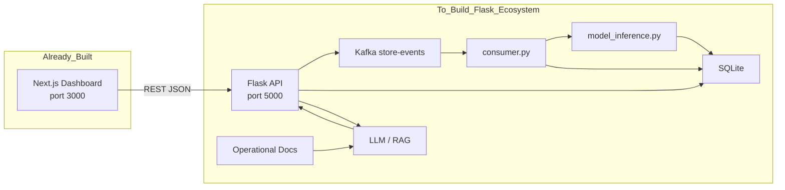
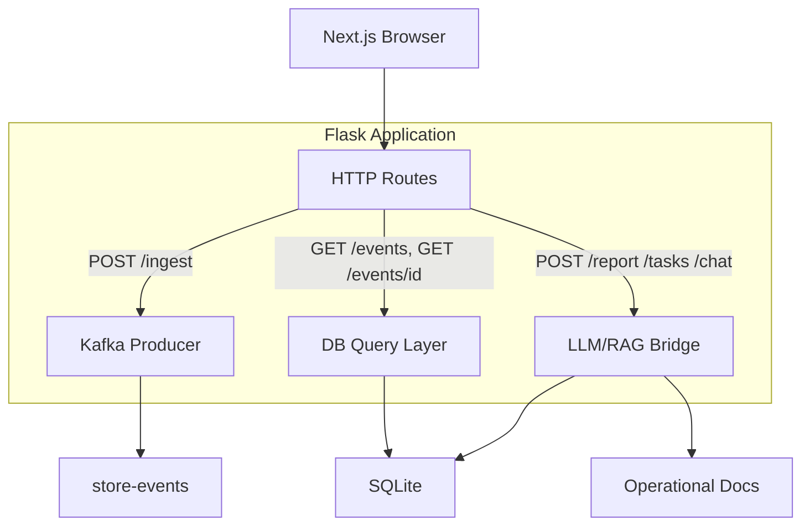
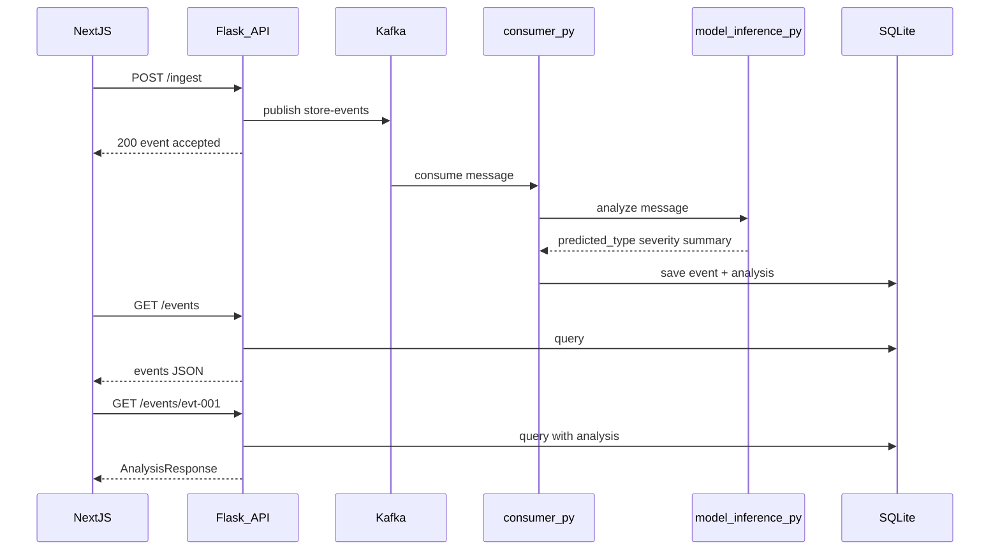

# AI 매장 운영 관제센터 — Flask API 구축 분석

> **문서 목적:** 구조도 PNG 두 장을 기준으로, **이미 구현된 Next.js 프론트엔드**가 호출할 **Flask API 서버**를 어떻게 구축할지 정리합니다.  
> **분석 기준일:** 2026-06-30  
> **범위:** 아키텍처·API 계약·구축 단계 분석 (구현은 별도 작업)

---

## 목차

1. [프로젝트 방향](#1-프로젝트-방향)
2. [분석 대상 이미지](#2-분석-대상-이미지)
3. [목표 시스템 구성](#3-목표-시스템-구성)
4. [Flask API 서버 역할](#4-flask-api-서버-역할)
5. [Next.js가 기대하는 API 계약](#5-nextjs가-기대하는-api-계약)
6. [Flask 내부 파이프라인 (구조도 기준)](#6-flask-내부-파이프라인-구조도-기준)
7. [5분 시연 흐름 → Flask 구현 매핑](#7-5분-시연-흐름--flask-구현-매핑)
8. [Flask 프로젝트 구축 단계](#8-flask-프로젝트-구축-단계)
9. [운영·시연 시 주의사항](#9-운영시연-시-주의사항)

---

## 1. 프로젝트 방향

### 현재 상태

| 레이어 | 기술 | 상태 |
|---|---|---|
| 프론트엔드 | Next.js 16 (App Router) + Zustand | **구현 완료** — 대시보드, 이벤트 UI, API 클라이언트 |
| API 서버 | Flask | **구축 예정** — 구조도에 정의된 게이트웨이·파이프라인 |
| 메시징 | Kafka (`store-events`) | Flask 구축 시 연동 |
| AI 분석 | consumer.py + model_inference.py | Flask 구축 시 연동 |
| 저장소 | SQLite | Flask 구축 시 연동 |
| LLM/RAG | 보고서·체크리스트·챗봇 | Flask 구축 시 연동 (mock 모드 지원) |

### 목표

Next.js는 **HTTP 클라이언트**로만 동작하고, Flask는 **유일한 백엔드 진입점**이 됩니다.

- Next.js → Flask: `http://127.0.0.1:5000` (환경변수 `NEXT_PUBLIC_API_BASE_URL`)
- Next.js → Kafka: **직접 연결 없음** (구조도 명시)
- Flask → Kafka / SQLite / LLM / RAG: 구조도에 따른 내부 연동

API 실패 시 Next.js는 `fallbackEvents` mock으로 화면을 유지하지만, **정상 시연·발표**를 위해서는 Flask 전체 파이프라인이 동작해야 합니다.

---

## 2. 분석 대상 이미지

| 파일 | 역할 in Flask 구축 |
|---|---|
| [`전체 아키텍처 구조도.png`](../전체%20아키텍처%20구조도.png) | Flask **정적 설계도** — 엔드포인트, Kafka, AI, DB, LLM/RAG 관계 |
| [`그래서 나오는 프로젝트 구조도.png`](../그래서%20나오는%20프로젝트%20구조도.png) | **통합 검증 시나리오** — Next.js + Flask를 5분 시연 순서로 붙일 때의 E2E 흐름 |

첫 번째 이미지 = **무엇을 만들 것인가**  
두 번째 이미지 = **만든 뒤 어떤 순서로 보여줄 것인가**

---

## 3. 목표 시스템 구성



### 레이어별 책임

| 레이어 | 담당 | Flask 구축 시 할 일 |
|---|---|---|
| Frontend | Next.js | 이미 구현 — Flask만 올리면 연동 |
| API Gateway | Flask | REST 엔드포인트, CORS, 요청 검증, DB/Kafka/LLM 조율 |
| Event Bus | Kafka | `store-events` 토픽, Producer(Flask) / Consumer(consumer.py) |
| AI Pipeline | consumer + model_inference | 메시지 분석, fallback 규칙 |
| Persistence | SQLite | 사건·분석 결과·조회용 데이터 |
| Knowledge | 운영 문서 | RAG ground truth (매뉴얼, 환불 정책, FAQ) |
| Intelligence | LLM/RAG | `/report`, `/tasks`, `/chat` 응답 생성 |

---

## 4. Flask API 서버 역할

구조도상 Flask는 **단순 CRUD가 아니라 오케스트레이터**입니다.



### 핵심 원칙 (이미지 명시)

1. **브라우저는 Kafka를 모른다** — 모든 쓰기/조회는 Flask URL로만
2. **Kafka는 전달 전용** — 분석 로직은 consumer + model_inference
3. **SQLite가 단일 조회 소스** — Dashboard의 `/events` 응답은 DB 기반
4. **Kafka 실패 fallback** — 구조도에 Flask → SQLite 직접 저장 경로(점선) 존재
5. **LLM/RAG mock 모드** — API Key 없이도 시연 가능해야 함

---

## 5. Next.js가 기대하는 API 계약

Flask는 **이미 Next.js에 정의된 타입·클라이언트**에 맞춰 응답해야 합니다.  
기준 파일: `src/entities/store-event/types.ts`, `src/shared/api/opsApi.ts`, `src/shared/config/env.ts`

**Base URL:** `http://127.0.0.1:5000`  
**Content-Type:** `application/json`  
**CORS:** Next.js dev origin (`http://localhost:3000`) 허용 필요

### 5-1. 엔드포인트 목록

| 메서드 | 경로 | Next.js 함수 | 용도 |
|---|---|---|---|
| GET | `/health` | `fetchHealth()` | API·Kafka·문서·LLM 상태 요약 |
| GET | `/events` | `fetchEvents()` | 사건 목록 |
| GET | `/events/<event_id>` | `fetchEventAnalysis()` | 사건 + AI 분석 결과 |
| POST | `/ingest` | `ingestEvent()` | 사건 접수 → Kafka(또는 fallback 저장) |
| POST | `/report` | `fetchReport()` | 점장용 보고서 |
| POST | `/tasks` | `fetchTasks()` | 직원 체크리스트 |
| POST | `/chat` | `fetchChat()` | RAG 챗봇 |

### 5-2. 요청·응답 스키마 (Flask 구현 기준)

#### `GET /health`

```json
{
  "status": "ok",
  "events_count": 3,
  "docs_count": 5,
  "llm_provider": "mock",
  "kafka_topic": "store-events"
}
```

#### `GET /events`

```json
{
  "count": 3,
  "events": [
    {
      "event_id": "evt-001",
      "event_type": "refund",
      "channel": "counter",
      "message": "환불 처리 지연 문의",
      "severity": "high",
      "status": "open",
      "requires_response": true,
      "predicted_type": "refund",
      "confidence": 0.92
    }
  ]
}
```

Next.js mock 참고: `src/entities/store-event/fallbackEvents.ts` (필드 형태 맞출 것)

#### `GET /events/<event_id>`

```json
{
  "event": { "event_id": "evt-001", "event_type": "refund", "...": "..." },
  "analysis": {
    "predicted_type": "refund",
    "sentiment": "negative",
    "severity": "high",
    "confidence": 0.92,
    "source": "model_inference"
  }
}
```

#### `POST /ingest`

**Request:**

```json
{
  "event_type": "refund",
  "channel": "counter",
  "message": "환불 처리 지연 문의",
  "severity_hint": "high",
  "store_id": "store-001"
}
```

**Response:**

```json
{
  "message": "event accepted",
  "event": { "event_id": "evt-004", "event_type": "refund", "...": "..." }
}
```

**Flask 내부 동작:** Kafka publish → (비동기) consumer 분석 → SQLite 저장.  
동기 응답은 접수 확인 + `event_id` 할당 수준이면 Next.js와 호환됩니다.

#### `POST /report` / `POST /tasks`

**Request:**

```json
{ "event_id": "evt-001" }
```

**Response:**

```json
{ "event_id": "evt-001", "result": "점장 보고서 본문..." }
```

#### `POST /chat`

**Request:**

```json
{
  "question": "환불 요청 고객에게 먼저 확인할 것은?",
  "event_id": "evt-001"
}
```

**Response:**

```json
{
  "answer": "영수증 및 결제 수단을 먼저 확인합니다.",
  "sources": ["운영 매뉴얼 3장", "환불 정책 v2"]
}
```

### 5-3. Kafka 메시지 스키마 (ingest → topic)

구조도 필드:

| 필드 | 설명 |
|---|---|
| `event_id` | Flask에서 생성 |
| `store_id` | 매장 식별자 |
| `event_type` | refund, delay, quality 등 |
| `message` | 고객/직원 문의 본문 |
| `severity_hint` | low / medium / high |

consumer.py는 `message`를 model_inference.py에 넘기고, 결과를 SQLite에 merge합니다.

---

## 6. Flask 내부 파이프라인 (구조도 기준)

### 6-1. 사건 접수 ~ 분석 저장 (단계 2~8)



### 6-2. model_inference.py 출력 (이미지)

| 필드 | 설명 |
|---|---|
| `predicted_type` | AI가 추정한 사건 유형 |
| `severity` | 심각도 |
| `action_required` | 조치 필요 여부 |
| `summary` | 한 줄 요약 |

DL 모델 불가 시 **규칙 기반 fallback** (구조도 명시) — 시연 전 필수 확인.

### 6-3. LLM/RAG 경로 (단계 11)

| 엔드포인트 | 입력 | 출력 |
|---|---|---|
| `/report` | SQLite 분석 결과 + event | 점장용 보고서 텍스트 |
| `/tasks` | 동일 | 직원 체크리스트 |
| `/chat` | question + 운영 문서 검색 | answer + sources |

운영 문서(매뉴얼, 환불 정책, 고객 응대 가이드, FAQ)는 RAG **근거 문서**로 로드합니다.

### 6-4. 권장 Flask 프로젝트 구조 (제안)

```
flask-api/                    # 별도 레포 또는 monorepo/backend
├── app.py                    # Flask 앱 진입, CORS, 라우트 등록
├── routes/
│   ├── health.py
│   ├── events.py             # GET /events, GET /events/<id>
│   ├── ingest.py             # POST /ingest
│   ├── report.py
│   ├── tasks.py
│   └── chat.py
├── services/
│   ├── kafka_producer.py
│   ├── db.py                 # SQLite 접근
│   ├── llm.py                # mock / real LLM
│   └── rag.py                # 문서 검색 + 답변
├── workers/
│   └── consumer.py           # Kafka consume → inference → DB
├── ai/
│   └── model_inference.py
├── data/
│   ├── ops.db                # SQLite
│   └── docs/                 # 운영 문서 (RAG)
├── requirements.txt
└── README.md
```

---

## 7. 5분 시연 흐름 → Flask 구현 매핑

발표 시연 8단계를 Flask 구축 **완료 기준**으로 사용합니다.

| 시연 구역 | 단계 | Next.js (이미 있음) | Flask (구축 대상) |
|---|---|---|---|
| **1. 사건 접수** | 1 | 사건 생성 폼 → `POST /ingest` | `/ingest` 수신, validation, event_id 발급 |
| | 2 | — | Kafka publish (또는 fallback DB write) |
| **2. 이벤트 전달** | 3~4 | — | Kafka `store-events`, consumer.py 기동 |
| **3. AI 분석** | 5 | — | model_inference.py 실행, SQLite 저장 |
| | 6 | 분석 패널 ← `GET /events/<id>` | DB에서 analysis join 조회 |
| **4. 활용 결과** | 7 | 보고서/체크리스트 버튼 | `POST /report`, `POST /tasks` + LLM(mock) |
| | 8 | RAG 챗봇 UI | `POST /chat` + sources 반환 |

### 시연 전 체크리스트

- [ ] Flask `5000`, Next.js `3000` 동시 실행
- [ ] `GET /health` → `status: ok`, `kafka_topic: store-events`
- [ ] `POST /ingest` 후 수 초 내 `GET /events`에 신규 사건 반영
- [ ] `GET /events/<id>`에 `analysis` 포함
- [ ] `/report`, `/tasks`, `/chat` mock이라도 200 + 본문/sources 반환

---

## 8. Flask 프로젝트 구축 단계

구조도·Next.js 계약을 기준으로 한 **권장 구현 순서**입니다.

### Phase 1 — API 골격 (Next.js 즉시 연동)

| 작업 | 산출물 |
|---|---|
| Flask 앱 + CORS | `app.py`, `localhost:3000` 허용 |
| SQLite 스키마 | events, analysis_results 테이블 |
| `GET /health` | HealthResponse 형식 |
| `GET /events` | seed 데이터 또는 fallbackEvents와 유사한 3건 |
| `GET /events/<id>` | AnalysisResponse 형식 (분석은 mock 규칙) |

→ 이 단계만으로 Next.js mock fallback 대신 **실 API** 연동 가능

### Phase 2 — 사건 접수 파이프라인

| 작업 | 산출물 |
|---|---|
| `POST /ingest` | IngestPayload 수신, event_id 생성 |
| Kafka Producer | `store-events` publish |
| consumer.py | consume → model_inference → SQLite |
| Kafka down fallback | ingest 시 SQLite 직접 저장 (구조도 점선 경로) |

### Phase 3 — AI 분석 고도화

| 작업 | 산출물 |
|---|---|
| model_inference.py | predicted_type, severity, action_required, summary |
| fallback 규칙 | 키워드/severity_hint 기반 (DL 없을 때) |
| `/events/<id>` | 실제 분석 결과 반환 |

### Phase 4 — LLM/RAG

| 작업 | 산출물 |
|---|---|
| 운영 문서 로드 | `data/docs/` |
| `POST /report`, `/tasks` | mock LLM → 이후 real LLM |
| `POST /chat` | answer + sources |
| mock 모드 플래그 | API Key 없이 시연 |

### Phase 5 — 통합 시연 검증

| 작업 | 산출물 |
|---|---|
| 5분 시연 스크립트 | 8단계 E2E 수동/자동 테스트 |
| Next.js E2E 확장 | Flask 실행 시 선택 테스트 ([TESTSCENARIO.md](../TESTSCENARIO.md)) |

---

## 9. 운영·시연 시 주의사항

| 항목 | 내용 |
|---|---|
| 포트 | Flask `5000`, Next.js `3000` — 충돌 시 env로 조정하되 양쪽 동기화 |
| CORS | preflight 포함 허용 |
| Kafka | consumer 미기동 시 ingest만 되고 분석·목록 반영이 지연될 수 있음 |
| Mock 모드 | LLM/RAG·inference 모두 mock 가능해야 발표 리허설 용이 |
| 비동기 지연 | ingest 직후 목록 새로고침 전 1~3초 대기 필요할 수 있음 (UI 안내 고려) |
| 보안 | 본 과정은 로컬 시연 기준 — 인증·rate limit은 추후 |

---

## 관련 문서

| 문서 | 설명 |
|---|---|
| [docs/project-handbook.md](./project-handbook.md) | Next.js 실행·운영 |
| [docs/test-plan.md](./test-plan.md) | Frontend 테스트 (Flask mock 기반) |
| [TESTSCENARIO.md](../TESTSCENARIO.md) | 테스트·E2E 확장 가이드 |
| [전체 아키텍처 구조도.png](../전체%20아키텍처%20구조도.png) | Flask 정적 설계 원본 |
| [그래서 나오는 프로젝트 구조도.png](../그래서%20나오는%20프로젝트%20구조도.png) | 5분 시연 E2E 원본 |
